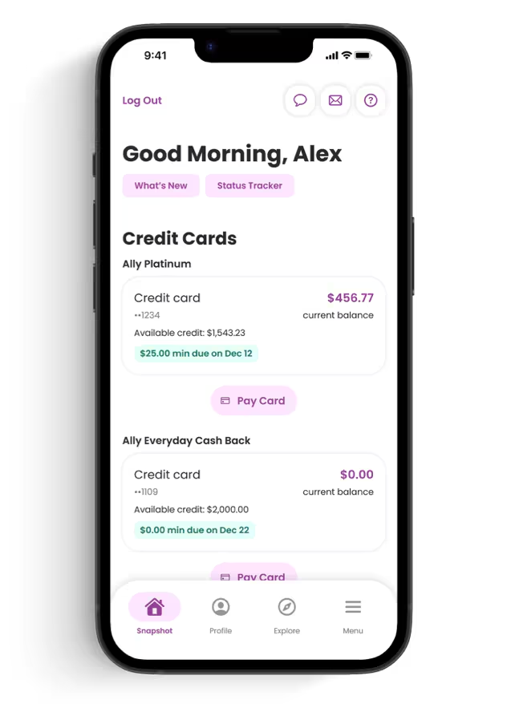
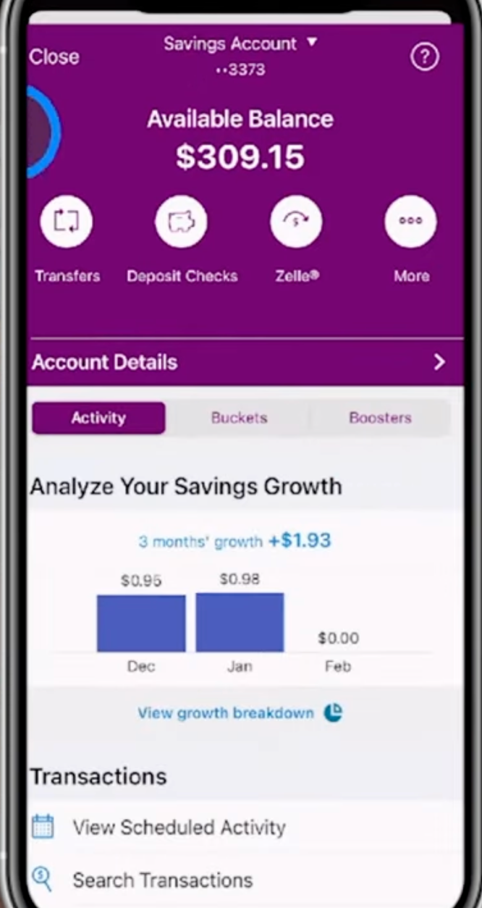
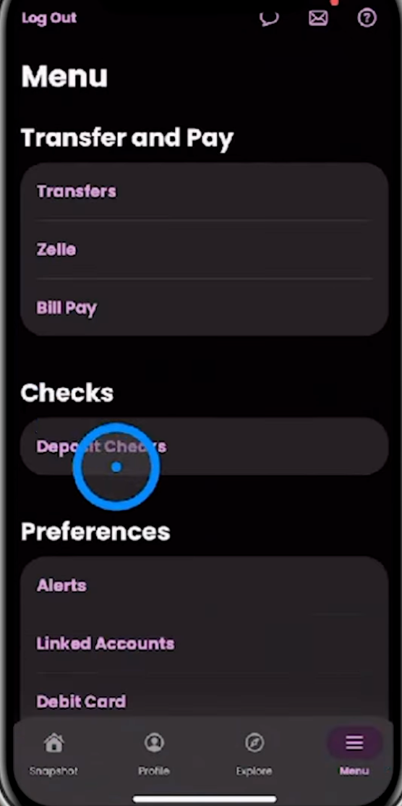
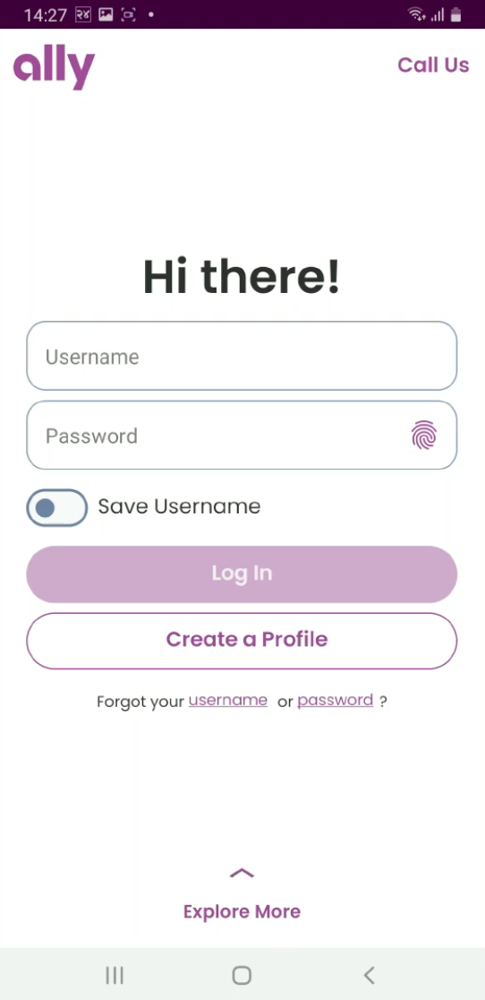

# Current Look of the Ally Bank App
[Video Walkthrough](https://www.youtube.com/watch?v=pDQigI0ooTk)

- Snapshot is essentially the account overview screen I would have worked on.
  - shows total, bank accounts, credit cards, loans, investments, etc.
  - can tap on a specific account to see details, transactions, statements, etc.

- when clicking on a savings or checking account

- this is the menu button on the main bottom nav bar
  - we care for the transfers, zelle, pay bills, options -> what I worked on

- when clicking on "Make a Transfer" below a checking or savings account
  - from, to, amount, date, frequency, note, submit

- shows fingerprint authentication prompt when logging in
  - I worked on integrating biometric auth into the login flow
- fingerprint data is not sent to the app or servers, just a yes/no from the Android Biometric API
  - this means it's very secure and meets banking security standards
  - anti-spoofing and liveness detection is handled by the OS
    - MFA for new devices or high-risk actions is also implemented
- navigate to the security settings to enable/disable biometric auth
  - features are dependent on device capabilities and OS version

## Why was I hired?
I was brought on as a Senior Android Developer to help modernize and stabilize Ally’s mobile banking app. 
At the time, they were migrating much of their legacy Java codebase to Kotlin and introducing new security and compliance-driven features like MFA and biometric authentication. 
They needed senior developers who could both implement these critical features and improve the overall architecture and performance of the app.
Moving towards ONE ALLY ecosystem -> banking, investing, loans, auto, home, etc. in a super app experience.

## What was the state of the project when I joined?
When I joined, the app was fully functional and had a large active user base, but there were issues with legacy Java code, inconsistent architecture patterns, and was fully XML UI.
The production environment was stable but heavily regulated — deployments required multi-stage approvals due to financial compliance. 
Overall, the app was solid, but there was a clear focus on refactoring, modernization, and enhancing security.

## What were my responsibilities?
1. Secure Login & Authentication:
Integrated Android Biometric APIs for fingerprint and face authentication, combined with MFA (SMS/Email OTP) and end-to-end encryption.
2. Account Management:
Built modular Kotlin-based features for viewing balances, transaction histories, and account summaries using MVVM and Clean Architecture.
3. Fund Transfers & Bill Pay:
Implemented the transfer flow using Retrofit for secure API communication, Coroutines for async processing, and Room for caching transaction data.
4. UI Modernization:
Built some new features with compose, compose was still maturing during this time, but gave our team leverage on knowing its use cases

## Banking Security Standards
CFPB: Consumer Financial Protection Bureau
- Focuses on protecting consumers from unfair or deceptive practices, safeguarding customer data, and ensuring clear disclosure and consent around how their data is used.
- For Android apps this translates into strong authentication, encryption in transit and at rest, secure handling of PII (Personally Identifiable Info), and clear UX flows for login, consent, and notifications.
FDIC: Federal Deposit Insurance Corporation
- Focuses on safety and soundness of financial institutions and protecting customer deposits.
- For Android apps this means following bank policies for access control, auditability, and incident response, and ensuring the app never bypasses server-side risk checks or compliance controls.
GFCR: Global Financial Cybersecurity Regulations
- Umbrella term for global banking cyber requirements (for example, FFIEC, PSD2, ISO 27001) that emphasize strong authentication, secure communication, and continuous monitoring.
- For Android apps this means hardened TLS, device integrity checks, secure key management, least-privilege access to APIs, and detailed logging for fraud investigation.

1. OAuth2 – “Delegated access”
   - Banks must never expose user credentials directly.
   - OAuth2 ensures that the mobile app exchanges secure tokens instead of passwords,
     like a user logs in with their username/password once, and the app then uses OAuth2 access/refresh tokens for subsequent API requests.
   - This aligns with CFPB security expectations and industry best practices for protecting customer data during authentication flows.

2. JWT – “Signed token”
   - JWTs provide cryptographically signed, tamper-evident session tokens.
   - This supports FDIC/CFPB guidelines around preventing unauthorized access and enables backend teams to perform clear audit tracking of user sessions and actions.

3. SPKI – “Key identity”
   - Subject Public Key Info pinning ensures the app talks only to your bank’s real servers.
   - This protects against MITM attacks—critical for GFCR (Global Financial Cybersecurity Regulations)–aligned secure communication requirements.

4. SSL Pinning – “Cert lock”
   - Further locks TLS connections so attackers cannot intercept or forge certificates.
   - Auditors often ask about this because financial apps require strong transport security for all account-related interactions.
   - Strong transport security here means enforcing modern TLS versions and ciphers, disabling cleartext HTTP, validating the full certificate chain, and adding pinning (SPKI or cert) for high-risk endpoints.
     - modern TLS versions and ciphers: TLS 1.2+ with AEAD ciphers (e.g., AES-GCM, ChaCha20-Poly1305)
     - disabling cleartext HTTP: disallowing HTTP connections, enforcing HTTPS only

5. Biometric Authentication – “Trusted unlock”
   - Used to secure account access, mobile check deposit, and high-risk actions (transfers, ACH, Zelle, etc).
   - Meets CFPB, FFIEC, and major banking security recommendations for strong, user-friendly authentication.

6. Encrypted SharedPrefs – “Secure storage”
   - Banks cannot store tokens or sensitive flags in plaintext.
   - Typically allowed to store: opaque access/refresh tokens, device identifiers, feature flags, and encryption nonces—as long as they’re encrypted at rest and server-side controls enforce expiration and revocation.
   - Sensitive flags include booleans or values that change security posture, such as “biometric enabled”, “device trusted”, “debug mode”, or internal kill-switches that guard risky features.
   - Encrypted storage satisfies data-at-rest requirements and reduces the risk of credential compromise during a device breach.
   - Modern approach is to prefer DataStore with encryption over raw SharedPreferences, while still using the same Jetpack Security / Keystore primitives under the hood.

7. Android Keystore – “Hardware keys”
   - Backed by TEE/StrongBox in modern devices.
   - TEE (Trusted Execution Environment) and StrongBox are hardware-backed secure environments that isolate cryptographic operations and key material from the main OS, making key extraction significantly harder.
   - Supports cryptographic key protection requirements for financial apps and often forms part of internal audits (“Where are your encryption keys stored?”).

8. Play Integrity / SafetyNet – “Device attestation”
   - Banks rely on device integrity signals to block rooted/emulated environments, which helps meet fraud-prevention and risk-scoring controls.
   - Fraud-prevention controls include blocking logins or high-risk actions from compromised devices, flagging suspicious device fingerprints, and feeding signals into anti-fraud and anomaly-detection systems.
   - Rooted environments are devices where the user (or attacker) has obtained root access, bypassing normal OS protections;
   - emulated environments are Android emulators that can be scripted or instrumented to attack APIs at scale.

9. R8/ProGuard – “Code obfuscation”
   - Prevents attackers from reverse-engineering security logic, API keys, or business rules—an expected part of secure SDLC when dealing with financial data.

10. Network Security Config – “TLS rules”
   - Ensures the app enforces modern TLS, restricts cleartext, and follows industry transport-security baselines.

pitch:
Ensured strict adherence to financial-industry standards (FDIC, CFPB, GFCR) by implementing mobile-specific security controls—including:
- OAuth2 token flows,
- JWT session hardening,
- biometric authentication,
- hardware-level key storage,
- SSL/SPKI pinning,
- and device-integrity checks—to:
deliver a compliant, secure, and audit-ready banking experience.

## 1. Secure Login & Authentication:
Integrated Android Biometric APIs for fingerprint and face authentication, combined with MFA (SMS/Email OTP) and end-to-end encryption.

### Biometric Authentication Flow
- Used **AndroidX Biometric** (`BiometricPrompt`) to gate access to the app after the initial credential-based login.
  - NOTE: AndroidX Biometric became stable in Jan 2021 for face, 2018 for fingerprint
    - before that was only finger with `FingerprintManager` which was deprecated in API 28 (2018)
- On first login, the user authenticated with **username/password + MFA**, then opted in to biometrics from the **Security/Settings** screen.
- When enabled, subsequent launches followed this pattern:
  - Check device capability and enrollment via `BiometricManager`.
  - On login screen can toggle between **biometric login** and **full login** (username/password + MFA).
    - if not compatible or no biometrics enrolled, fall back to full login
    - Show the **system biometric prompt** (fingerprint/face/device credential) using `BiometricPrompt`.
  - On success, unlock a **keystore-backed encryption key** and decrypt the token needed to start a secure session.
  - On failure/cancel, fall back to **full login** (username/password + MFA) rather than weakening security.
- Ensured that **biometric templates never leave the device**—we only receive a yes/no signal from the OS, which aligns with bank and regulator expectations.

### MFA Flow (Multi-Factor Authentication)
- Implemented MFA as an additional factor on top of username/password, especially for:
  - **New devices**,
  - **High-risk actions** (adding payees, large transfers), and
  - **Suspicious logins** flagged by backend risk engines.
- Typical flow:
  - User enters username/password.
  - Backend evaluates risk and, when required, sends an **OTP via SMS or email**.
    - OTP (One-Time Password) is a 6-digit numeric code, valid for 5-15 minutes.
  - App presents an **OTP entry screen** with timer, resend, and accessibility-friendly messaging.
  - OTP is verified server-side; on success we receive **short-lived access tokens and a refresh token**.
- Integrated MFA strongly with the login state machine so that:
  - All security decisions (when to challenge, when to block) are **owned by the backend**.
  - The app simply renders the correct step based on server responses, which keeps logic centralized and auditable.

#### Create Cross-Team Communication Story
Worked closely with backend, security, UX, and product to design the MFA experience end-to-end:
- Backend & security: 
  - aligned on risk signals (new device, geo-velocity, high-value transfers) and when to force MFA vs. when to allow silent login. 
  - We iterated on an API-driven state machine (e.g., PASSWORD_REQUIRED -> MFA_REQUIRED -> AUTHENTICATED) so the app always trusted the server for decisions.
- UX: 
  - partnered to design the OTP screens (timer, resend, error states) so they were clear, accessible, and localized, while still reinforcing security (e.g., limited attempts, clear messaging on lockouts).
- Product: 
  - negotiated trade-offs between conversion and security by reviewing data from early test users and pilot rolls; for example, relaxing MFA on low-risk logins but tightening it around adding new payees or large transfers.

To keep everyone aligned:
- Ran short design reviews and API contract sessions where we walked through sequence diagrams of the MFA flow.
- Used feature flags to gradually roll out the new MFA policies, collect metrics (drop-off, failure rates), and adjust thresholds with security/product without needing new app releases.

Outcome: arrived at an MFA flow that met security/audit requirements while keeping the login experience fast and understandable for normal users.

### End-to-End Encryption Flow
- All communication with backend services used **TLS 1.2+** with strong cipher suites, enforced via **Network Security Config** and **certificate/SPKI pinning**.
- On top of TLS, sensitive payloads (for example, **credentials, MFA codes, and session tokens**) were:
  - Sent only over **POST**/secure endpoints,
  - Structured as **OAuth2 token exchanges**, and
  - Never logged in plaintext on the device.
- For local storage:
  - **Refresh tokens and session-related secrets** were stored via **Jetpack Security** (`EncryptedSharedPreferences` / encrypted `DataStore`) using a key from the **Android Keystore**.
  - **Access tokens** were kept in memory only and refreshed on expiration/401 responses.
- This combination gave us effective "end-to-end" protection: 
  - encrypted on device -> via Android Keystore + Jetpack Security (encrypted DataStore / EncryptedSharedPreferences) for tokens and sensitive data at rest 
  - encrypted over the wire -> encrypted over the wire -> via TLS 1.2+ enforced with Network Security Config and SSL/SPKI pinning for all banking APIs 
  - validated/sanitized on the server -> validated/sanitized on the server -> via OAuth2/JWT-based auth, centralized input validation, and server-side risk/MFA policies before executing any sensitive operation 

### Challenges & Solutions
- **Challenge: Balancing security with UX**
  - Frequent MFA prompts or aggressive timeouts can frustrate users.
  - **Solution:** 
    - Worked with security and product to define **risk-based rules** (for example, longer sessions on low-risk devices, step-up MFA only for high-value actions). 
    - Implemented this as **server-driven policy**, so we could tune behavior without shipping new app versions.

- **Challenge: Handling biometric edge cases across devices/OS versions**
  - Different OEMs and OS levels behaved slightly differently (no enrolled biometrics, hardware failures, or flaky sensors).
  - **Solution:** Standardized on **AndroidX Biometric**, added clear fallback paths (PIN/password + MFA), and implemented robust error handling and analytics to monitor failure rates by device/OS.
  - Android 9+ supported face and fingerprint via AndroidX Biometric, older versions only fingerprint.

- **Challenge: Secure token storage and rotation**
  - Needed to persist login state without ever exposing long-lived credentials.
  - **Solution:** 
    - Kept access tokens in memory only
    - stored refresh tokens in **encrypted storage** backed by **Android Keystore**
    - implemented **token rotation** and forced logout on suspicious activity or backend revocation.

- **Challenge: Compliance and auditability**
  - Security teams and auditors required clear evidence of how login, MFA, biometrics, and encryption were implemented.
  - **Solution:**
      - Documented the **end-to-end login sequence**, data flows, and storage locations:
          - Used `Confluence` for written runbooks and implementation notes.
          - Created sequence diagrams and data-flow diagrams in `draw.io` (diagrams.net) and linked them from tickets and Confluence.
          - Kept architecture decisions in lightweight `ADR` pages so security and audit could see when/why changes were made.
            - ADR = Architecture Decision Record
      - Added structured logging (without PII/secrets) around auth flows so operations and audit teams could trace login attempts and MFA challenges end-to-end:
          - On Android, logged key auth events (login start/success/failure, MFA challenge/verify, biometric success/fallback) to a centralized pipeline via the existing logging SDK (built on top of `Timber` + backend log aggregation).
            - Log.d styled logs -> normalized eventType, timestamp, deviceId, appVersion, userId (hashed), eventDetails (non-PII) -> sent to backend logging system (SIEM)
            - called the logging SDK at auth points (login start, login success, login failure, mfa challenge sent, mfa verified, biometric success, biometric fallback)
          - Used `Firebase Crashlytics` for crash-level visibility and stability around the login/MFA flows, but routed security/audit events to the bank’s internal log/`SIEM` rather than third‑party analytics.
            - no 3rd party -> don't send PII or sensitive info to Firebase, only crash stack traces and non-PII metadata
            - regulatory compliance says we need to keep sensitive logs in-house

## 2. Account Management:
Built modular Kotlin-based features for viewing balances, transaction histories, and account summaries using MVVM and Clean Architecture.
- worked on both the snapshot screen -> dashboard overview of all accounts
  - 
  - are all account types in a single API? probably not, so had to aggregate data from multiple sources
    - used **SupervisorJob** to manage multiple coroutines for fetching different account types concurrently
    - combined results into a unified data model for the dashboard for Lazy Column display
- and the specific account screen -> detailed view of a single account with transactions
  - only the checking and savings accounts were in my scope
  - 

## 3. Fund Transfers & Bill Pay:
Implemented the transfer flow using Retrofit for secure API communication, Coroutines for async processing, and Room for caching transaction data.
- security with SSL pinning, OAuth2 tokens, JWT session management