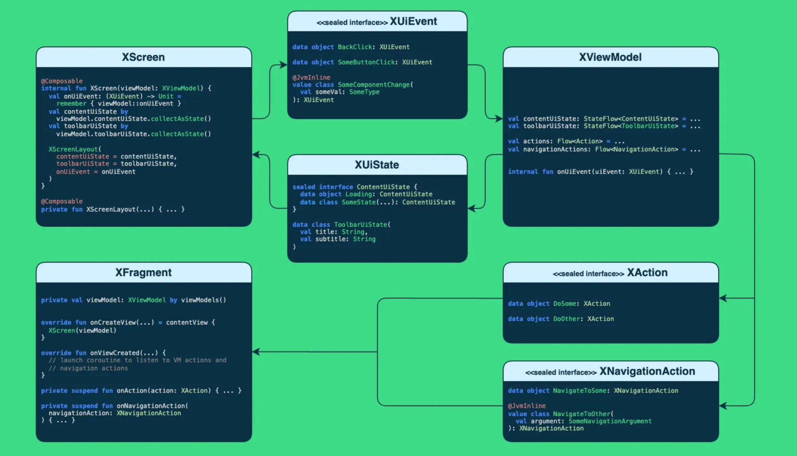

# Resources:
- [Practical Guide Step-by-Step - Medium](https://medium.com/@sivavishnu0705/6f05df5a6fa8)

- [Journey of Migration pt1 - Medium](https://medium.com/yubo-tech/android-migration-a-journey-from-xml-to-jetpack-compose-part-1-3982f17889b2)
- [Journey of Migration pt2 - Medium](https://medium.com/yubo-tech/android-migration-a-journey-from-xml-to-jetpack-compose-part-2-f441e91dc109)
- [Journey of Migration pt3 - Medium](https://medium.com/yubo-tech/android-migration-a-journey-from-xml-to-jetpack-compose-part-3-f1a1f59f4c7b)

- [Story of Migration pt1 - Medium](https://proandroiddev.com/xml-to-compose-in-production-an-android-journey-part-1-7f9a8369f868)
- [Story of Migration pt2 - Medium](https://proandroiddev.com/xml-to-compose-in-production-an-android-journey-part-2-eeb425ed971a)
  - I didn't add any notes from this, but it provides real examples of migrating xml screens to jetpack compose
  - provides some good architecture patterns for generic adapter, compose theming, compose states and more


# Migration Overview

## Phase 1: The Foundation (Modern Gradle Setup)

Before writing Composables, you need to sync your environment. In 2026, we lean on the Compose BOM (Bill of Materials) to manage versioning and ensure all libraries play nice together.

In your build.gradle.kts (Module level):

```kotlin
android {
    buildFeatures {
        compose = true
    }

    composeOptions {
        // Tip: Always check the latest compatibility map for your Kotlin version
        kotlinCompilerExtensionVersion = "1.5.11" 
    }
}

dependencies {
    // Manage versions via BOM to avoid dependency hell
    val composeBom = platform("androidx.compose:compose-bom:2025.02.00")
    implementation(composeBom)

    implementation("androidx.compose.ui:ui")
    // ...
}
```

## Phase 2: The “Trojan Horse” Strategy (ComposeView)
You don’t need to replace an entire Fragment at once. Use ComposeView to embed a small Compose element directly inside an existing XML layout. This is the gold standard for incremental migration.

Step 1: Add the placeholder to your XML
```xml
<androidx.compose.ui.platform.ComposeView
    android:id="@+id/compose_header_container"
    android:layout_width="match_parent"
    android:layout_height="wrap_content" />
```

Step 2: Bind it in your Fragment/Activity
```kotlin
binding.composeHeaderContainer.apply {
    // Crucial: This ensures the composition is disposed of correctly
    setViewCompositionStrategy(ViewCompositionStrategy.DisposeOnViewTreeLifecycleDestroyed)
    setContent {
        AppTheme { 
            ModernHeader(title = "Account Settings")
        }
    }
}
```

## Phase 3: Converting Lists (RecyclerView → LazyColumn)
The RecyclerView is where XML feels heaviest. Moving to LazyColumn eliminates Adapters and ViewHolders entirely.

```kotlin
@Composable
fun TransactionList(transactions: List<Transaction>) {
    LazyColumn(
        modifier = Modifier.fillMaxSize(),
        contentPadding = PaddingValues(16.dp)
    ) {
        items(
            items = transactions,
            key = { it.id } // Stable keys for high-performance scrolling
        ) { transaction ->
            TransactionRow(transaction)
        }
    }
}
```

## Phase 4: Navigation During Migration
Don’t feel pressured to swap out Navigation Component for Navigation Compose on day one. They are highly compatible.

Hybrid Approach: Keep your nav_graph.xml. Create a Fragment for your new Compose screen and use ComposeView inside it.
Step-by-Step: Migrate individual screens to Fragments-hosting-Compose first. Once a flow is 100% Compose, you can then replace that specific sub-graph with native Navigation Compose.
- TODO: does ComposeView use lifecycle of a fragment or of Compose? or both? does this combine problems of both xml and compose, e.g. handling recomposition and destroying bindings, etc.?

## Common Migration Pitfalls (Avoid These!)
Even experienced teams stumble during migration. Keep an eye out for these:

- The Nesting Trap: Never put a LazyColumn inside a legacy ScrollView or another LazyColumn. This breaks scroll physics and crashes your app. 
- State Leaks: Passing mutable objects (like a User object that gets modified directly) instead of immutable UI state prevents Compose from knowing when to redraw. 
- The Imperative Mindset: Don’t try to “call functions” on a Composable from your Fragment. Instead, update a state in the ViewModel and let the Composable react.
  - so it follows the same rules as XML, not compose?

## Frequently Asked Questions (FAQs)
1. Does adding Compose increase my APK size?
> Initially, yes. You are shipping two UI toolkits. However, as you remove legacy XML layouts and custom View logic, the size usually levels out. The reduction in code complexity is almost always worth the few extra MBs.

2. Can I use my existing XML themes in Compose?
> While tools like the Accompanist Theme Adapter exist, they are in maintenance mode. For long-term stability, manually map your XML design tokens (colors, typography) into a native MaterialTheme in Compose.

3. Is Compose faster than XML?
> Compose often matches or outperforms XML in complex, deeply nested layouts. However, performance in Compose is a direct result of how you handle state. Use the Layout Inspector to check for excessive recompositions.


# Journey of Migration
## Why Migrate?
Velocity: moving fast in the right direction
- This means being reactive, prioritizing effectively, and turning failures into successes. 
- To do this, we need a scalable architecture that allows us to iterate fast on new features.

Compose offered a perfect opportunity to simplify development, reduce maintenance overhead, and unlock the potential for more complex and dynamic UIs.

## First Steps (Foundation)
rethinking our theming and architecture to ensure Compose could seamlessly fit into our app’s ecosystem.

### Theming — Material or not Material?
Custom theme (not Material)
- To achieve this, we leveraged Compose’s CompositionLocalProvider, allowing us to build a system that’s both consistent and easy to extend.
- balance between customization and inspiration from Material gave us the freedom to implement a design system tailored to our needs without sacrificing scalability or maintainability.
```kotlin
@Composable
fun YuboTheme(
  colorMode: ColorMode = System,
  content: @Composable () -> Unit,
) {
  val colors = colors(colorMode)
  val rippleIndication = ripple()

  CompositionLocalProvider(
    LocalColors provides colors,
    LocalColorMode provides colorMode,
    LocalTypography provides DefaultTypography,
    LocalDimension provides DefaultDimension,
    LocalIndication provides rippleIndication,
    LocalShapes provides shapes,
    content = content,
  )
}
```

### Architecture — From MVP to a Compose-Ready Design
For simplicity, especially during migration, we decided to keep using fragments as our navigation strongly relied on them. 
At the same time, we decided not to only migrate the UI, but also to improve our MVVM architecture by:

Using StateFlow with sealed interfaces to manage UiState(s) in ViewModels, collected as state in the top level screen composable.
Defining UiEvent sealed interfaces to facilitate communication from composable functions back to the ViewModel.
Defining Action and NavigationAction sealed interfaces to handle navigation and other actions collected from the ViewModel in the screen fragment.
Standardizing the naming and structure of all these classes to have an homogeneous code.




### Tryouts — Our first Compose screen
Before diving into full-screen implementations, we focused on creating our first reusable components.

We started with key elements like labels, buttons, user cells, or the toolbar, ensuring they were flexible and easy to integrate into various screens

Given that our app relies on a custom theme rather than Material, we built custom components that wrap Material elements, adapting them to fit our design system seamlessly.
```kotlin
// Example of Material component wrapping

@Composable
fun RadioButton(
  selected: Boolean,
  onClick: (() -> Unit)?,
  modifier: Modifier = defaultModifier(),
  enabled: Boolean = true,
  interactionSource: MutableInteractionSource? = null,
  colors: RadioButtonColors = RadioButtonDefaults.colors(), // custom colors
) {
  androidx.compose.material.RadioButton(
    selected = selected,
    onClick = onClick,
    modifier = modifier,
    enabled = enabled,
    interactionSource = interactionSource,
    colors = colors.toMaterialColor(), // mapping to Material colors
  )
}
```

## Second Steps (Our first challenges — Performances)

### Recomposition
unnecessary recompositions can lead to inefficiencies and negatively impact the user experience.

To mitigate performance issues, we implemented several strategies:
1. Stability: 
  - ensure that objects passed as parameters to composable functions are stable.
```kotlin
@Immutable
data class SomeUiState(
  val someSubState: SubState,
  val someString: String,
) {

  @Immutable
  data class SubState(
    val someString: String,
    val someInt: Int,
  )
}

@Stable
class SomeState {
  // ...
}

@Composable
fun Some(
  uiState: SomeUiState,
  state: SomeState,
) {
  // uiState and state are stable and won't force a recomposition when not
  // necessary
}
```

To handle collections and some other non-stable internal classes, we configured the Compose compiler accordingly:
[Stability Documentation](https://developer.android.com/develop/ui/compose/performance/stability/fix)
```.properties
# Stability configuration file

kotlin.collections.*
kotlin.ranges.*
# other internal classes you want to consider stable
```

2. Optimized modifiers: 
  - For animations or fast-updating states, we rely on lambdas for modifiers affecting sizes, offsets, or any graphics layer.

```kotlin
// Don't
// This will recompose for each tick of the alpha animation
@Composable
fun SomeComponent() {
  val alpha by animateFloatAsState(0.5f)
  
  Box(modifier = Modifier.alpha(alpha)) {
    // [...]
  }
}

// Do
// This will only redraw
@Composable
fun SomeComponent() {
  val alpha by animateFloatAsState(0.5f)
  
  Box(modifier = Modifier.graphicsLayer { this.alpha = alpha }) {
    // [...]
  }
}
```

3. Inline functions
  - In Compose, it may seem like an entire composable is recomposing unnecessarily, but this is often due to inline functions like Box, Row, or Column. Their inline nature makes recompositions in their children appear as though the parent is fully recomposing.
  - To solve this, extract frequently recomposing parts of the UI into separate composable functions. This isolates recompositions and improves both performance and code clarity.

```kotlin
// Don't
// This will recompose the entire SomeComponent function even if some parts
// are "skipped"
@Composable
fun SomeComponent() {
  Column {
    Box { /* ... */ }
    Box { /* ... */ }
    Box {
      var text by remember { mutableStateOf("") }
 
      LaunchEffect(Unit) {
        var seconds = 0
    
        while (true) {
          text = "Seconds since first composition: $seconds"
          delay(1.seconds)
          ++seconds
        }
      }
   
      Text(text = text)
    }
  }
}

// Do
// This will only recompose the CounterText composable
@Composable
fun SomeComponent() {
  Column {
    Box { /* ... */ }
    Box { /* ... */ }
    Box {
      CounterText()
    }
  }
}

@Composable
fun CounterText() {
  var text by remember { mutableStateOf("") }
 
  LaunchEffect(Unit) {
    var seconds = 0
  
    while (true) {
      text = "Seconds since first composition: $seconds"
      delay(1.seconds)
      ++seconds
    }
  }
 
  Text(text = text)
}
```

4. Debugging tools
  - Instead of relying on the standard Modifier we created a custom defaultModifier() function. In debug mode, this modifier highlights the bounds of the composable it’s used on if it recomposes too frequently, making it easier to identify and resolve performance issues.
```kotlin
fun defaultModifier(highlightRecomposition: Boolean = true): Modifier =
  if (highlightRecomposition && BuildConfig.ENABLE_COMPOSE_DEBUG_TOOLS) {
    Modifier.then(recomposeModifier)
  } else { 
    Modifier
  }
 
private val recomposeModifier =
  Modifier.composed(inspectorInfo = debugInspectorInfo { name = "recomposeHighlighter" }) {
    // custom implementation of 
    // https://github.com/android/snippets/blob/main/compose/recomposehighlighter/src/main/java/com/example/android/compose/recomposehighlighter/RecomposeHighlighter.kt
  }
```
  - Additionally, tools like the Android Studio Layout Inspector or Rebugger can be valuable to identify and resolve recomposition issues when necessary.
  - [Rebugger](https://github.com/theapache64/rebugger)

5. Image management
  - Custom Image preloader similar to Glide
```kotlin
// Custom state that holds the measurements of an image Composable, usually
// the one used in the items of the lazy list
// Used to set the size of the image preloaded with Glide
val asyncImageState = rememberAsyncImageState()

LazyListPreloader(
  lazyListState = lazyListState,
  items = pagingItems,
  itemsProvider = { item, _ -> listOf(item.profilePicture) },
  sizeProvider = { _, _, _ -> asyncImageState.measuredSize },
  maxPreloadPosition = 5,
)
```

  - To aid debugging, we also added a visual indicator for each image, showing its source (network, memory, or disk). This helps us quickly identify and resolve potential issues during development.
```kotlin
var debuggerColor: Color? by remember { mutableStateOf(null) }

GlideImage(
  modifier = modifier.drawWithContent {
    drawContent()
    debuggerColor?.let {
      drawCircle(
        color = it,
        radius = 10f,
        center = Offset(size.width / 2f, size.height / 2f),
      )
    }
  },
  // [other params...]
  requestBuilderTransform = { transform ->
    transform.debugRequestState { color ->
      debuggerColor = color
    }
  }
)

// [...]

private fun RequestBuilder<Drawable>.debugRequestState(
  color: (Color) -> Unit,
): RequestBuilder<Drawable> {
  return addListener(
    object : RequestListener<Drawable> {
      override fun onLoadFailed(
        e: GlideException?,
        model: Any?,
        target: Target<Drawable>,
        isFirstResource: Boolean,
      ): Boolean {
        color(Color.Red)
        return false
      }

      override fun onResourceReady(
        resource: Drawable,
        model: Any,
        target: Target<Drawable>?,
        dataSource: DataSource,
        isFirstResource: Boolean,
      ): Boolean {
        color(
          when (dataSource) {
            LOCAL -> Color.Black
            REMOTE -> Color.Blue
            DATA_DISK_CACHE -> Color.Yellow
            RESOURCE_DISK_CACHE -> Color.Orange
            MEMORY_CACHE -> Color.Green
          },
        )
        return false
      }
    },
  )
}
```

6. Remaining known issues
Debugging:
  - The debugging experience for Compose is far from ideal, which can make performance issues harder to track down. When a screen shows performance issues in debug, we always test it on a release build to verify if the issue remains. This is especially crucial for low-performance devices, which represent a significant portion of the devices used by our users.
  - Testing on these phones with release builds provides a much clearer picture of real-world performance, ensuring we can optimize the experience for all users, regardless of their hardware.

JIT:
  - Since Compose generates a significant amount of dynamic code during compilation, it relies more heavily on JIT (Just-in-Time) compilation compared to XML-based views. This dependency can lead to noticeable slowdowns in the UI for a short time after installation. 
  - Baseline profiles help address this by precompiling critical code paths during app installation, significantly improving startup times and runtime performance. 
  - While we experimented with baseline profiles, they didn’t have a noticeable impact in our case and introduced significant maintenance overhead, so we chose not to use them. However, libraries that provide integrated baseline profiles can fully leverage these optimizations for smoother performance.


## Final Steps (Migration — Strategy and Results)

### Approach
1. Iteration
  - To minimize risks, we decided to migrate the app screen by screen. This approach allowed us to maintain a functional app at all times while progressively integrating Compose into our workflows. 
  - For reusable components, we learned that although the design system looked similar but had entirely different contexts of use. Rather than building a single, highly flexible reusable component with numerous parameters, we chose to create multiple components that shared the same design but each handled their own state. This approach helped us keep our codebase simpler and more maintainable while ensuring each component was tailored to its specific use case.

2. Tooling
  - We developed a custom IntelliJ plugin that generates boilerplate code for screens using our architecture, or even modules of an entire feature. 
    - less comments related to the architecture in PRs. 
    - standards simplified the onboarding of newcomers, who can easily integrate into the project.
  - implemented custom Detekt rules to enforce code consistency and catch potential issues early, making it easier for the team to align on best practices.

