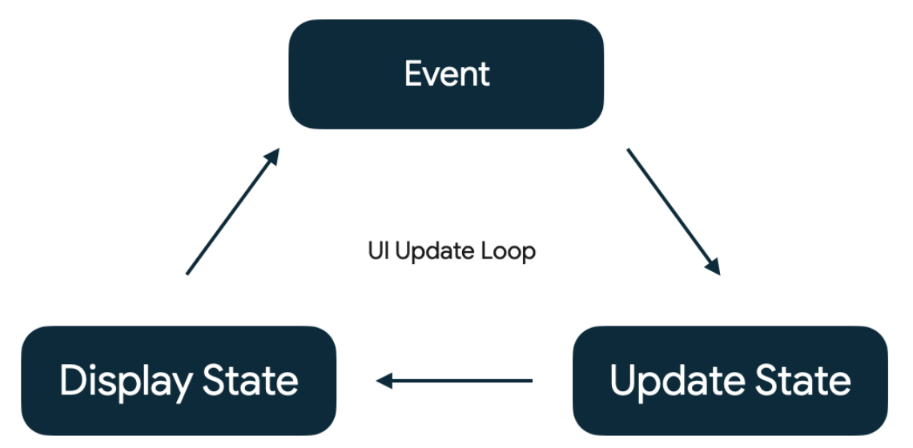

# Task
- I'm the scrum master -> setup tickets in Jira
- android dev does QA, DevOps, etc. 
- ticket specific for researching a library or tool = spike
- need to research Scrum Master role (responsibilities, ceremonies, etc)
  - making tickets
  - facilitating ceremonies (standup, retro, planning, etc)
  - removing blockers

- He'll give us some code labs and youtube to follow as extra content
- Basic Intro: Jetpack Compose Tutorial "https://www.developer.android.com/develop/ui/compose/tutorial"

# Compose
## Concepts
- Compose is built with Material Design principles
- XML was done at runtime, Compose is done at compile time (faster for user)
- Doesn't use margins, uses padding instead 
  - align properties inside a View Group (EquallySpaced, SpaceBetween, etc)
- uses hierarchy of composable functions to build UI
  - meaning you have a parent composable function that contains child composable functions
- Many things are the same
  - for Navigation we still use NavController, NavHost, NavGraph, etc but in a different way
  - ViewModel is still the same, just use `viewModel()` function to get it
  - LiveData and StateFlow still work, but StateFlow is preferred
- State is a big concept in Compose
  - remember -> used to store state in a composable function
  - mutableStateOf -> creates a mutable state object that can be observed for changes (like LiveData or StateFlow)
  - by -> property delegate that allows us to use state variables without calling .value all the time
  - when state changes, the composable function is recomposed (redrawn)
  - rememberSaveable -> like remember but saves state across configuration changes (like screen rotation)
    - consumes more memory, so use only for small pieces of state (like text input)
- recomposition -> when state changes, the composable function is recomposed (redrawn)
  - Compose is smart and only recomposes what needs to be changed (not the whole screen)
  - avoid unnecessary recompositions by keeping state as close to where it's used as possible
  - use `derivedStateOf` to create state that is derived from other state (only recomposes when the derived state changes)
- side-effects -> operations that have side effects (like network calls, database operations, etc)
  - LaunchedEffect -> runs a suspend function when the key changes (like when the composable enters the composition)
  - rememberCoroutineScope -> gets a CoroutineScope that is tied to the composable's lifecycle
  - SideEffect -> runs a block of code after every successful recomposition
  - DisposableEffect -> runs a block of code when the key changes and disposes when the composable leaves the composition
- themes -> use MaterialTheme to define colors, typography, shapes, etc
  - can create light and dark themes and switch between them
  - use `isSystemInDarkTheme()` to check if the system is in dark mode
- Preview -> use @Preview annotation to preview composables in Android Studio without running the app
  - can specify parameters like showBackground, widthDp, heightDp, etc
- LIFECYCLE
  - STATE -> EVENT -> EFFECT (MODIFY STATE) -> RECOMPOSITION (UI UPDATES)
    - only recomposes what changed, not the whole screen
## ViewGroups
- Column -> vertical arrangement
- Row -> horizontal arrangement
- Box -> overlapping arrangement, no dimensions unless specified (like constraints layout)
- Scaffold -> material design layout structure (topBar, bottomBar, floatingActionButton, drawer, content)
  - also handles insets (status bar, navigation bar)
- LazyColumn -> like RecyclerView, only composes what is visible on screen (efficient for long lists) - scrollable
  - items -> takes a list/array and a lambda to define how each item looks
    - Lazy layouts such as LazyRow and LazyHorizontalGrid automatically add scrolling behavior. 
    - However, you don't always need a Lazy layout. 
    - In general, you use a Lazy layout when you have many elements in a list or large data sets to load, so emitting all items at once would come at a performance cost and would slow down your app. 
    - When a list has only a limited number of elements, you can instead choose to use a simple Column or Row and add the scroll behavior manually. 
    - To do so, you use the verticalScroll or horizontalScroll modifiers. These require a ScrollState, 
    - which contains the current state of the scroll, used to modify the scroll state from outside. 
    - In this case, you're not looking to modify the scroll state, so you simply create a persistent ScrollState instance using rememberScrollState.
- LazyRow -> horizontal version of LazyColumn
- Modifier -> used to modify the appearance or behavior of a composable (like layout, padding, background, click events, etc)
  - can be chained together
  - order matters (e.g. padding then background is different from background then padding)
  - common modifiers: fillMaxSize(), fillMaxWidth(), fillMaxHeight(), padding(), background(), click(), align(), weight(), size(), height(), width()
- Arrangement -> defines how to arrange children in a Row or Column (e.g. Arrangement.Center, Arrangement.SpaceBetween, Arrangement.SpaceEvenly, Arrangement.spacedBy(8.dp))
- Alignment -> defines how to align children in a Row or Column (e.g. Alignment.CenterVertically, Alignment.CenterHorizontally, Alignment.Top, Alignment.Bottom)
- Spacer -> empty space between composables, can specify width and height
- Surface -> a container that uses MaterialTheme colors, can have elevation, shape, etc
- Card -> a Surface with default padding and elevation, used to display related information
- Divider -> a thin line used to separate content

## Views
- Text -> displays text
- Button -> clickable button
- TextField -> input field
- Image/Icon/IconButton -> displays an image

## Gradle
- only big difference is:
```gradle
buildFeatures {
    compose true
}
```
- using compose versions of dependencies

```kotlin
class MainActivity : ComponentActivity() { // ComponentActivity is a base class for activities that want to use the support library action bar features.
    override fun onCreate(savedInstanceState: Bundle?) {
        super.onCreate(savedInstanceState)
        setContent { // setContent instead of setContentView
            // we are passing in a lambda that defines our UI
            // Composable functions go here
            Column(
                modifier = Modifier
                    .fillMaxSize()
                    .padding(16.dp),
                verticalArrangement = Arrangement.Center,
                horizontalAlignment = Alignment.CenterHorizontally
            ) {
                Row(
                    modifier = Modifier.fillMaxWidth(), // this is required to make the Row take up the full width to center its children
                    verticalAlignment = Alignment.CenterVertically
                ) {
                    Text(text = "Hello, World!", fontSize = 24.sp)
                    Text(text = " Welcome to Jetpack Compose.", fontSize = 24.sp)
                }
                Spacer(modifier = Modifier.height(16.dp))
                Button(onClick = { /* Handle click */ }) {
                    Text(text = "Click Me")
                }
            }
        }
    }
}
// mark with @Composable annotation to indicate it's a composable function (UI element) 
// we use CapitalCamelCase for composable function names by convention to distinguish from regular functions
@Composable
fun Greeting(name: String, modifier: Modifier = Modifier) {
    Text(text = "Hello $name!")
}

@Preview(showBackground = true) // preview in design view
@Composable
fun DefaultPreview() {
    Greeting("Android")
}
```

## See Preview without running app
- use @Preview annotation above a composable function
- cmd + option + M -> 

```kotlin
@Preview
@Composable
fun PreviewGreeting() {
    Scaffold { innerPadding ->
        Column(
            modifier = Modifier
                .padding(innerPadding)
                .fillMaxSize()
                .padding(16.dp),
            verticalArrangement = Arrangement.Center,
            horizontalAlignment = Alignment.CenterHorizontally
        ) {
            Row(
                modifier = Modifier.fillMaxWidth(), // this is required to make the Row take up the full width to center its children
                verticalAlignment = Alignment.CenterVertically
            ) {
                Text(text = "Hello, World!", fontSize = 24.sp)
                Text(text = " Welcome to Jetpack Compose.", fontSize = 24.sp)
            }
            Spacer(modifier = Modifier.height(16.dp))
            Button(onClick = { /* Handle click */ }) {
                Text(text = "Click Me")
            }
        }
        
    }
}
```

## Events
- Any action that causes the modification of state is called an "event" and we'll learn more about this in the next section.
- Events are inputs generated from outside or inside an application, such as:
  - The user interacting with the UI by, for example, pressing a button. 
  - Other factors, such as sensors sending a new value, or network responses.

- Events notify a part of a program that something has happened. In all Android apps, there's a core UI update loop that goes like this:
  - Event - An event is generated by the user or another part of the program. 
  - Update State - An event handler changes the state that is used by the UI. 
  - Display State - The UI is updated to display the new state.



## Composition
- **The Composition**: a description of the UI built by Jetpack Compose when it executes composables. 
- **Initial composition**: creation of a Composition by running composables the first time. 
- **Recomposition**: re-running composables to update the Composition when data changes.
  - Compose also looks at what data an individual composable needs, so that it only recomposes components whose data has changed and skips those that are not affected.

### State and MutableState
- Use Compose's State and MutableState types to make state observable by Compose.
- Compose also has other variants of mutableStateOf, such as mutableIntStateOf, mutableLongStateOf, mutableFloatStateOf, or mutableDoubleStateOf, which are optimized for the primitive types.

## Troubleshooting
- Warning: You might be tempted to add logs in Logcat to debug your composable functions to try to figure out if they're working properly. 
- However, be aware that this process might not be very reliable when working with Compose due to, for example: 
- recompositions being discarded, as explored in [Thinking in Compose](https://developer.android.com/jetpack/compose/mental-model).

